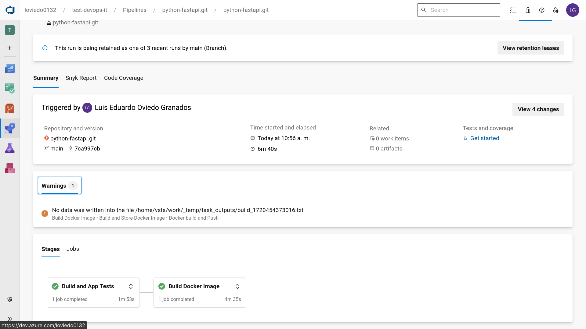
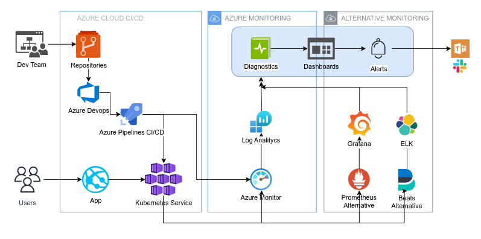

### TEST-DEVOPS-IT MILlINION LOVIEDO

# FastAPI Microservice

Este repositorio contiene un microservicio desarrollado con FastAPI, este se encuentrara desplegado en un clúster de Kubernetes o con Docker localmente, tambien se implementa una estrategia de CI con un  pipeline de Azure DevOps que realiza integracion del codigo, pruebas unitarias, pruebas estaticas y dinamicas con snyk y pruebas de la imagen docker en busca de vulnerabilidades , adicionalmente se configura un Worker de Cloudflare para redimensionar y almacenar en caché imágenes. por ultimo  se incluyen algunas estrategias de monitoreo para mejorar la observabilidad como propuesta.

## Contenidos

- [Instalación](#instalación)
- [Despliegue en Kubernetes](#despliegue-en-kubernetes)
- [Pipeline de Azure DevOps](#pipeline-de-azure-devops)
- [Worker de Cloudflare](#worker-de-cloudflare)
- [Alternativas de Monitoreo](#alternativas-de-monitoreo)

## Instalación

### Requisitos

- Python 3.9+
- Docker local
- Cuenta docker hub para almacenaje de imagen
- Kubernetes (Minikube, k3s, GKE, etc.)
- Azure DevOps
- Cloudflare Account
- Node.js (para Cloudflare Workers)
- Draw.io para graficar las alternativas de observabilidad

### Clonar el repositorio

```sh
git clone https://github.com/luisog207/test-devops-it.git
cd test-desvops-it
```

### Configurar el entorno virtual y dependencias

```sh
python -m venv venv
source venv/bin/activate
pip install -r requirements.txt
```

### Ejecutar el microservicio localmente con uvicorp o con Docker

```sh
uvicorn app.main:app --host 0.0.0.0 --port 8000
```
```sh
```sh
docker build -t luisog207/python-fastapi  .
docker run -p 8000:8000 luisog207/python-fastapi
``````

## Despliegue en Kubernetes

### Configuración de Deployment

Archivo: `deployment.yaml`

```yaml
apiVersion: apps/v1
kind: Deployment
metadata:
  name: fastapi-app
spec:
  replicas: 2
  selector:
    matchLabels:
      app: fastapi-app
  template:
    metadata:
      labels:
        app: fastapi-app
    spec:
      containers:
      - name: fastapi-app
        image: luisog207/python-fastapi:34
        resources:
          limits:
            memory: "3Gi"        
          requests:
            memory: "1Gi"           
        ports:
        - containerPort: 8000
```

### Configuración de Service

Archivo: `service.yaml`

```yaml
apiVersion: v1
kind: Service
metadata:
  name: fastapi-service
spec:
  selector:
    app: fastapi
  ports:
    - protocol: TCP
      port: 80
      targetPort: 8000
  type: ClusterIP
```
### Configuración de Network Policy

Archivo: `networkpolicy.yaml`
Este cumplira el criterio de red internal-prod en el namespace tech-prod
```yaml
apiVersion: networking.k8s.io/v1
kind: NetworkPolicy
metadata:
  name: internal-prod
  namespace: tech-prod
spec:
  podSelector:
    matchLabels:
      app: fastapi-app
    ingress:
    - from:
      - podSelector:
          matchLabels:
            app: fastapi-app
    ports:
    - protocol: TCP
      port: 8000
```
### Exponer el servicio localmente
se puede exponer el servicio ajustando a load balancer, ingress nodeport, pero para efecto de pruebas locales se realizara mediante port forwarding reenviando un puerto local al puerto del cluster

```sh
kubectl port-forward service/fastapi-app 8080:80  -n tech-prod
```
```sh

### Creacion recursos solicitados y despliegue en Kubernetes

```sh
kubectl create namespace tech-prod
kubectl get namespaces
kubectl apply -f deployment.yaml -n tech-prod
kubectl apply -f service.yaml -n tech-prod
kubectl apply -f networkpolicy.yaml -n tech-prod
```

## Pipeline de Azure DevOps

### Configuración del Pipeline

Archivo: `azure-pipelines.yml`

```yaml
# Name of the pipeline
# Created by Luis Oviedo
name: $(Build.DefinitionName)


trigger:
 branches:
   include:
     - main


pool:
 vmImage: 'ubuntu-latest'


variables:
 pythonVersion: '3.9'


stages:
 - stage: Build
   displayName: 'Build and App Tests'
   jobs:
     - job: Build
       displayName: 'Build and Test'
       steps:
         - task: UsePythonVersion@0
           inputs:
             versionSpec: '$(pythonVersion)'
             addToPath: true


         - script: |
             python -m venv venv
             source venv/bin/activate
             python -m pip install --upgrade pip
             pip install -r requirements.txt
             pip install pytest
             pip install pytest-cov             
           displayName: 'Install dependencies'


         - script: |
             source venv/bin/activate
             pytest --cov=./test --cov-report=xml --doctest-modules
           displayName: 'Run unit tests'
         - task: SnykSecurityScan@1
           inputs:
             serviceConnectionEndpoint: 'snyk'
             testType: 'code'
             failOnIssues: false           
           displayName: 'Snyk Code SecurityScan'
 - stage: BuildDockerImage
   displayName: 'Build Docker Image'
   jobs:
     - job: Docker
       displayName: 'Build and Store Docker Image'
       steps:
         - task: Docker@2
           inputs:
             containerRegistry: 'python-fastapi'
             repository: 'luisog207/python-fastapi'
             command: 'buildAndPush'
             Dockerfile: '**/Dockerfile'
           displayName: 'Docker build and Push'             
         - task: SnykSecurityScan@1
           inputs:
             serviceConnectionEndpoint: 'snyk'
             testType: 'container'
             dockerImageName: 'luisog207/python-fastapi'
             dockerfilePath: 'Dockerfile'
             monitorWhen: 'always'
             failOnIssues: false
           displayName: 'Snyk Test Container Image'
```


## Worker de Cloudflare

### Configuración del Worker

Archivo: `worker.js`
Se toma como base un repositorio de ejemplo para resize image caching publico:


### Configuración de Wrangler

Archivo: `wrangler.toml`

```toml
name = "image-resizer"
type = "javascript"

workers_dev = true
```

### Desplegar el Worker

```sh
npm create cloudflare 
wrangler publish
npm wrangler dev 
```

## Alternativas Observabilidad

Considero existen varias herramientas para generar una estrategia optima de observabilidad para las herramientas previamente mencionadas, en k8 y azure, se pueden utilizar algunas de las siguientes herramientas
- **Prometheus**: Sistema para monitorear y recopilar alertas.
- **Grafana**: Plataforma de monitoreo para visualizar métricas en tiempo real y concluir.
- **ELK Stack (Elasticsearch, Logstash, Kibana)**: Suit de herramientas para colectar, visualizar, analizar logs generados por aplicaciones.
- **Azure Monitor**: Servicio propio de Microsoft Azure con colector y dashboardas para informacion de métricas y logs de aplicaciones y servicios en Azure.



Teniendo en cuenta estas consideraciones, se realiza esta gráfica con las propuestas de observabilidad
se establece la solución inicial con las herramientas propias de Azure, también se dan algunas alternativas con Prometheus-Grafana y la suite de elk
En general todas tienen un denominador común que es un colector de las métricas y logs en tiempo real y de herramientas de filtrado y análisis de dichos logs, así como de gráfica de los mismos, junto con algunas opciones de seguridad, filtrado, grupos de usuarios y demás opciones propias de cada suite de observabilidad, estas también se pueden conectar con algún sistema de mensajería que permite recibir alertas sobre los microservicios.
